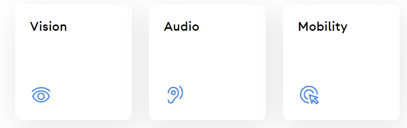

# Accesibilidad

Android cuenta con varias opciones de accesibilidad como el modo de lectura para gente con problemas de visibilidad, transcripción en vivo y amplificador de sonido para gente con problemas de audición y controlador por voz para gente con problemas de movilidad.

