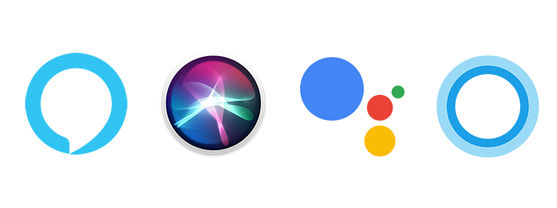

# Asistente de voz

Los dispositivos Android tienen acceso a varios asistentes de voz de entre los cuales se encuentra Google Now, el cual permite configurar alarmas, abrir aplicaciones y enviar mensajes. Otra opción bastante popular es Cortana quien es la versión de Siri hecha por Microsoft.

