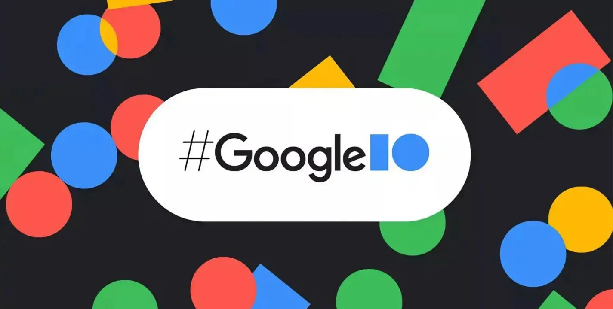

# Google Developer Conference

Google Developer Conference (también conocido como “Google I/O”) es una conferencia global de tecnología que se lleva a cabo de forma anual por Google en California. Dentro de esta conferencia Android ha presentado sus nuevas versiones y productos todos los años, estableciéndose así como una marca sinónima con la conferencia.

