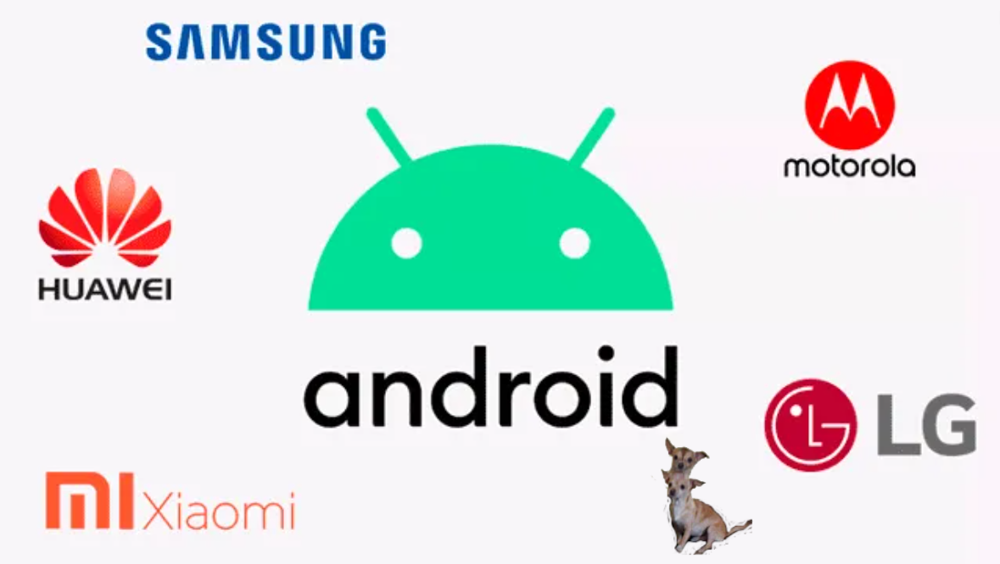

# Marcas que usan Android

Actualmente existen miles de marcas que usan Android como su sistema operativo, pero las marcas más destacables son Sony, Samsung, HTC, Nokia, Motorola, Xiaomi, Lenovo, Microsoft y Google.

Los precios de los dispositivos que venden estas marcas van desde 2000 MXN hasta 15200 MXN aproximadamente.

